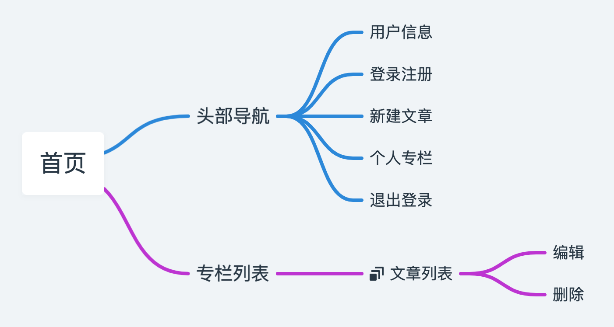
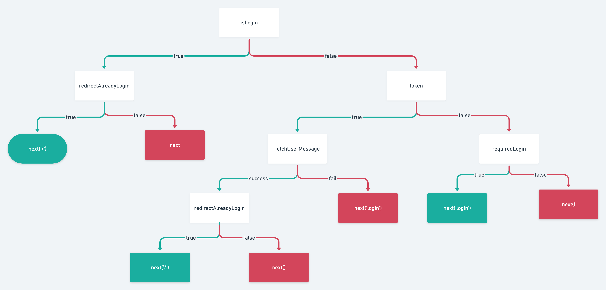

本项目来自慕课网	[vue3+ts仿知乎专栏企业级项目](https://coding.imooc.com/class/449.html)

[在线文档](http://docs.vikingship.xyz/)
[接口地址](http://api.vikingship.xyz/public/swagger/index.html)

## 前言

项目比较基础，但是内容比较多涵盖了vue全家桶，所以很多功能没有实现的很细致，比较适合vue3的入门和练习，总体看完还是会有一些收获的，像包括作者使用的流程图 [whimsical](https://whimsical.com/) ，样式库 [Bootstrap5](https://getbootstrap.com/docs/5.0/getting-started) 对我来说都是很好的工具，部署平台 [vercel](https://vercel.com/) 也能很方便的部署前端项目。

这里结合作者的思路和自己对vue3的理解，做一些查缺补漏和笔记的整理。

## 项目脑图



## teleport

Vue3的新特性 [teleport](https://v3.cn.vuejs.org/guide/teleport.html) 可以实现子节点在父节点外的dom渲染。

涉及使用 `teleport` 使用的组件：

- 消息提示框 `message`
- 模态框 `modal`

使用 `teleport` 可以完成组件在根元素外指定节点元素的插入操作：

```html
<!-- In some nested Vue component -->
<NestedComponent>
  <Teleport to="#teleport-target">
    <PopUp />
  </Teleport>
</NestedComponent>
<!-- before closing body tag in index.html -->
<div id="teleport-target"></div>
```

> 在 tsx 中使用 teleport 绑定组件时会出现警告提示，提示在渲染前无法找到 teleport 对应的dom节点。


## 继承父组件属性 

继承父组件属性到指定的子组件标签上，例如自定义表单：

父组件：

```html
<validate-input type="text" placeholder="username" />
```

子组件：

```html
<template>
	<div class="validate-input">
    <!-- 子组件继承父组件属性  -->
		<input v-bind="$attrs" />
	</div>
</template>

<script>
  export default {
    inheritAttrs: false
  }
</script>
```

父子属性的继承需要 `inheritAttrs:false`  配合 `$attrs` 的使用，文档地址：[inheritAttrs](https://v3.cn.vuejs.org/api/options-misc.html#inheritattrs)。

2.x 和 3.x 的区别：[$attrs 行为](https://v3.cn.vuejs.org/guide/migration/attrs-includes-class-style.html#_2-x-%E8%A1%8C%E4%B8%BA)

项目里面关于上传的组件 `Uploader` 有用到此行为，其中文件标签 `<input type='file'>` 有许多属性可以针对上传前的操作进行配置，详情请查看 [MDN 文档](https://developer.mozilla.org/zh-CN/docs/Web/HTML/Element/Input/file)，这里列下几个实用属性：

| 属性 | 说明 |
|----|----|
| accept | 可以选择的文件类型，accept="image/*" 表示可选所有图片 |
| capture | 移动端开发常用，表示用户可以调用的设备的摄像头，user=前置，environment=后置 |
| multiple | 是否可以多选 |

> 对于 `Uploader` 组件的封装，既要考虑到组件封装的配置，也要让用户能够使用 input 标签属性的设置。


## Computed values

子组件对于父组件传进来的 `v-model` 值进行完全控制，还需要费一番操作，具体如下：

- 监听 modelValue 的变化
- 修改 modelValue 需通过 `emit("update:modelValue")` 触发

针对这种繁琐的操作，在以前项目中通常会使用组合函数 `useModel` 进行操作：

```tsx
// useModel
function useModel<T>(getter: () => T, emitter: (val: T) => void) {
  const model = ref(getter()) as { value: T }

  watch(getter, (newVal) => {
    if (newVal !== model.value) {
      model.value = newVal
    }
  })

  return {
    get value() {
      return model.value
    },
    set value(val: T) {
      model.value = val
      emitter(val)
    },
  }
}
```

使用：

```js
const inputVal=useModel(()=>props.modelValue,(val)=>emit("update:modelValue",val));
```

#### 项目收获

项目中作者使用 [reactivity-computed-watchers](https://v3.vuejs.org/guide/reactivity-computed-watchers.html#computed-values) 的方式控制 `v-model` 的值，让我更好的理解了`get`和`set` 在计算属性中的用途。

利用 `computed` 的  `get` 和 `set` 可以方便的控制 `modelValue` 的变化：

```js
const inputRef = computed({
  get: ()=> props.modelValue,
  set: (val)=> emit("update:modelValue",val)
})

// 修改 inputRef 会触发 set 通知父组件更新
inputRef.value = "change"
```


## 路由权限




## 优化和扩展

### 优化 createMessage 组件

项目中的 `createMessage` 组件虽然完成了功能需求，但使用起来太生硬，这里对它进行了改造，优化如下点：

- 提示框的淡入淡出动画效果
- 返回 `Promise` 函数，期望在消息提示框销毁后，以`Promise.resolve`方式通知组件
- 扩展`success`、`danger`、`warning`方法接口

#### 淡入淡出动画

淡入淡出动画通过样式处理，定义类名 `fade-in` 和 `fade-out` 和样式：

```css
.alert.message-info.fade-in {
  animation: fadeInDown .2s;
}
.alert.message-info.fade-out {
  pointer-events: none;
  animation: fadeOutUp .2s;
}

@keyframes fadeInDown {
  0% {
    opacity: 0;
    transform: translateY(-50%);
  }
  100% {
    opacity: 1;
    transform: translateY(0);
  }
}

@keyframes fadeOutUp {
  0% {
    opacity: 1;
    transform: translateY(0);
  }
  100% {
    opacity: 0;
    transform: translateY(-50%);
  }
}
```

定义类名和动画时间：

```ts
// 淡入淡出类名
const aniCls = ref<'fade-in' | 'fade-out' | null>(null);

// 消息框样式 type = 'default' | 'success' | 'danger' | 'warning'
const classes = computed(() => [
  aniCls.value,
  `alert-${props.type}`,
]);
```

显示和隐藏方法：

```ts
const handler = {
  async show() {
    aniCls.value = "fade-in";
    return await delay(actionDur);
  },
  async close() {
    aniCls.value = "fade-out";
    await delay(actionDur);
    return isVisible.value = false;
  },
};

const ctx = getCurrentInstance()!;

// 将方法绑定到组件上，供父组件使用
Object.assign(ctx.proxy, handler);
```

淡入淡出这里还有优化空间，例如短时间内多次触发`createMessage`方法，一般不希望后面执行的提示消息挡住之前还未销毁的消息，所以这里会对每次消息提示框的高度做个缓存，创建时累加高度，销毁后再将高度复原。

组件外新建 临时缓存 数组：

```ts
let indexArr = [] as Array<null | Symbol>;
```

计算当前高度：

```ts
const symbol = Symbol();
const top = (()=>{
  // 查询为 null 的位置
  let i = indexArr.indexOf(null);            
  if(i>=0){
    // 插入到 null 的位置
    indexArr.splice(i,1,symbol);
    return i*60 + "px"
  }else{
    // 没有表示都未销毁，就按最大高度
    let len = indexArr.length
    indexArr.push(symbol);
    return len*60 + "px"
  }
})();

const styles = {
  "animationDuration": actionDur/1000 + "s",
  "top":top
}
```

销毁时置为null:

```ts
handler{
  close(){
    aniCls.value = "fade-out";
    await delay(actionDur);
    // 找到当前缓存的位置，重置为null
    const i = indexArr.indexOf(symbol)
    indexArr.splice(i,1,null);
    // 都为null时，重置缓存数组
    if(indexArr.every(item=>!item)){
      indexArr = []
    };
    return isVisible.value = false;
  },
}
```

#### 返回 Promise 函数

和普通组件不同，消息提示框一般通过方法调用，如果用户期望在组件销毁后得到通知，最好的通过 Promise 传递消息：

```js
createMessage("这是一条通知")
.then(
  ()=>console.info("消息框销毁了")
)
```

所以对 `createMessage` 方法做了如下改造：

```js
function createMessage(options: MessageOptions) {
  const { type = 'default', message = '', duration = 2000 } = options
  // defer，获取 Promise 相关方法
  const dfd = defer()
  // 创建应用实例，传递参数
  const app = createApp(Message, {
    options: { type, message, duration },
  })
  // 创建挂载节点
  const el = document.createElement('div')
  document.body.appendChild(el)
  
  // 获得根组件实例
  const incs = app.mount(el) as any
  
  // 前面 Message 组件已通过 Object.assign 将组件方法挂载
  // 显示消息弹窗
  incs.show().then(() => {
    // 成功显示后，开始销毁倒计时
    setTimeout(async () => {
      // 先关闭
      await incs.close()
      // 销毁
      app.unmount()
      document.body.removeChild(el)
      // 相当于执行了 return Promise.resolve
      dfd.resolve()
    }, duration)
  })

  return dfd.promise
}
```

#### 扩展 createMessage 方法

为了让 `createMessage` 能更方便的使用，期望扩展如下方法：

- message.default(message,options)
- message.success(message,options)
- message.danger(message,options)
- message.warning(message,options)

同时保留 message({type,message,options}) 方法。

定义类型：

```ts
type MessageType = 'primary' | 'success' | 'danger' | 'warning'

type TypeMethod = {
  [type in MessageType]: (
    message: string,
    options?: Omit<MessageOptions, 'type' | 'message'>
  ) => any
}

interface MessageOptions {
  type: MessageType
  message: string
  duration?: number
}

interface MessageMethod extends TypeMethod {
  (options: MessageOptions): any
}

const messageTypes: MessageType[] = ['success', 'danger', 'warning', 'primary']

const messageMth = messageTypes.reduce((pre, type) => {
  pre[type] = (
    message: string,
    options?: Omit<MessageOptions, 'type' | 'message'>
  ) => createMessage({ type, message, ...(options || {}) })
  return pre
}, {} as { [key: string]: any })

function initMessage(): MessageMethod {
  const result = Object.assign(createMessage, messageMth)
  return result as MessageMethod
}

const message = initMessage()

export default message
```

## Provider/Inject 代替嵌套组件通信

项目中表单组件通过 `emitt` 实现嵌套的父子组件间的通信，Vue3 提供的 `Provider/Inject` 结合 `Composition API` 使用也可以很方便的达到目的。

这里以 `Dropdown` 组件为例，点击子组件 `DropdownItem`  后，触发父组件提供的关闭方法：

```tsx
// Dropdown.vue
import { provide } from "vue";

export interface ProviderParam {
  toggleOpen: () => void;
}

export const dropdownSymbol = Symbol()

setup(){
  provide<ProviderParam>(dropdownSymbol,{toggleOpen});
}
```

```tsx
// DropdownItem.vue
import { inject } from "vue";
import { dropdownSymbol,ProviderParam } from "./Dropdown.vue";

setup(){
  const { toggleOpen } = inject<ProviderParam>(dropdownSymbol)!;
}
```

